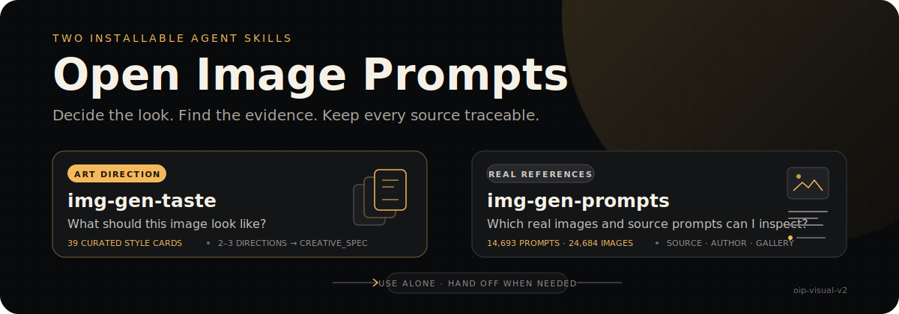

<p align="center">
  
</p>

<p align="center">
  <strong>English</strong> · <a href="./README.zh-CN.md">简体中文</a>
</p>

# Open Image Prompts

An open, local-first visual prompt archive with two installable Agent Skills:

- `img-gen-taste` turns a rough brief into a clear art direction.
- `img-gen-prompts` retrieves traceable prompt-image references and opens a local comparison gallery.

The public runtime snapshot contains **14,693 source prompts**, **4,496 approved local images**, **29,386 translations**, **170,226 active v2 prompt labels**, and a closed taxonomy of **185 visual labels**. Labeling models, backfill tools, provider configuration, test runs, error logs, and other labeling-process records are not included.

## Start locally

Requirements:

- Git and [Git LFS](https://git-lfs.com/)
- Node.js `^20.19.0 || >=22.12.0`
- Python 3.10+

The same commands work on Windows, macOS, and Linux:

```bash
git lfs install
git clone https://github.com/NanmiCoder/open-image-prompts.git
cd open-image-prompts
npm run setup
npm run dev
```

Open the local URL printed in the terminal. The first start expands the compressed SQLite archive into the ignored `.oip/runtime/` directory, launches a loopback-only read-only API, and starts the Vite frontend.

To build and preview the production frontend locally:

```bash
npm run preview
```

The launcher automatically finds `py -3` or `python` on Windows and `python3` or `python` on macOS/Linux. Set `OIP_PYTHON` if Python is installed under a custom executable name.

## Run with Docker

Docker provides a Linux-isolated runtime with Node.js 22 and Python 3. The image build runs the public data checks, API/frontend tests, lint, and production build before producing the runtime image:

```bash
git lfs pull
docker build -t open-image-prompts .
docker run --rm --name open-image-prompts -p 4173:4173 open-image-prompts
```

Open <http://localhost:4173>. The API remains loopback-only inside the container and is exposed only through the frontend proxy. The image runs as the unprivileged `node` user and includes a `/health` health check.

The build context is roughly 900 MB because the approved images and compressed SQLite archive are intentionally self-contained. The same commands work with Docker Desktop on Windows/macOS and Docker Engine on Linux.

## Install the Skills

List and install both Skills:

```bash
npx skills add NanmiCoder/open-image-prompts --list
npx skills add NanmiCoder/open-image-prompts -g
```

`img-gen-taste` works immediately from its bundled style cards. `img-gen-prompts` uses this repository's public SQLite archive and approved images:

```bash
export OIP_REPO_ROOT="$PWD"  # PowerShell: $env:OIP_REPO_ROOT = (Get-Location)
npm run status
```

A ready checkout reports `"active_taxonomy_version": "oip-visual-v2"` and `"ready": true`.

Example:

```bash
python3 skills/img-gen-prompts/scripts/oip.py search \
  --intent "vintage city travel poster" \
  --limit 5
```

On Windows, replace `python3` with `py -3` or use the Skill through a compatible Agent.

## Public data boundary

The public DB deliberately contains only product runtime data:

- source prompts and source URLs;
- approved local image records;
- bilingual translations;
- active `oip-visual-v2` prompt/image labels;
- the public taxonomy and FTS search index.

It does **not** contain labeling candidates, model/provider settings, run IDs, leases, model rationales, error paths, evaluation tables, or legacy label assignments. The included local image subset consists only of generated `allow` decisions from the public-image policy snapshot; unreviewed, `review`, `remove`, and failed decisions are excluded.

See [DATASET.md](./DATASET.md), [DATA_LICENSE.md](./DATA_LICENSE.md), and the machine-readable [public corpus manifest](./data/public-corpus.json).

## Validate a checkout

```bash
npm test
npm run lint
npm run build
npm run status
```

The API and Skill open SQLite in read-only immutable mode. The gallery binds to `127.0.0.1` by default and never starts a labeling job.

## License

Application code and Skill instructions are available under the [MIT License](./LICENSE). Dataset licensing and third-party-content boundaries are documented separately in [DATA_LICENSE.md](./DATA_LICENSE.md).
