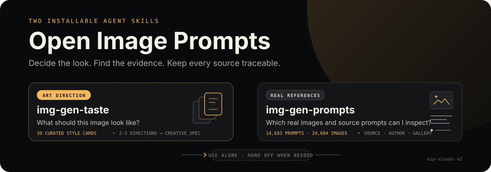

<p align="center">
  
</p>

<p align="center">
  <strong>English</strong> · <a href="./README.zh-CN.md">简体中文</a>
</p>

# Open Image Prompts

An open, local-first visual prompt archive with two installable Agent Skills:

- `img-gen-taste` turns a rough brief into a clear art direction.
- `img-gen-prompts` retrieves traceable prompt-image references and opens a local comparison gallery.

The public dataset contains **15,033 source prompts**, **25,216 images**, **29,388 translations**, **170,238 active v2 prompt labels**, and a closed taxonomy of **185 visual labels**. Labeling models, backfill tools, provider configuration, test runs, error logs, and other labeling-process records are not included.

Dataset assets ship through [GitHub Releases](https://github.com/NanmiCoder/open-image-prompts/releases) instead of Git LFS: the repository clone stays small, and `scripts/fetch_dataset.py` downloads the SQLite archive (~80 MB) plus optional monthly image packs (~4.3 GB total) with sha256 verification. See `data/dataset-manifest.json` for the exact asset list.

## One-click start

Install [Git](https://git-scm.com/downloads) and [Node.js](https://nodejs.org/) 20.19+ or 22.12+, then clone the repository:

```bash
git clone https://github.com/NanmiCoder/open-image-prompts.git
cd open-image-prompts
```

Start on macOS or Linux:

```bash
./start.sh
```

Start on Windows:

```bat
start.bat
```

You can also double-click `start.bat` in File Explorer. The launcher installs [uv](https://docs.astral.sh/uv/) when needed, creates a compatible Python environment, downloads the dataset from GitHub Releases, installs the frontend packages, and starts both services. Open the local URL printed in the terminal. To skip the multi-gigabyte image packs (the gallery then falls back to original source URLs), set `OIP_FETCH_SKIP_IMAGES=1` before starting.

The first start expands the compressed SQLite archive into the ignored `.oip/runtime/` directory. Later starts reuse the Python environment while refreshing locked dependencies.

## Run with Docker

Docker provides a Linux-isolated runtime with Node.js 22 and Python 3. The image build runs the public data checks, API/frontend tests, lint, and production build before producing the runtime image:

```bash
docker build -t open-image-prompts .
docker run --rm --name open-image-prompts -p 4173:4173 open-image-prompts
```

Open <http://localhost:4173>. The API remains loopback-only inside the container and is exposed only through the frontend proxy. The image runs as the unprivileged `node` user and includes a `/health` health check.

The build downloads the SQLite archive from GitHub Releases (network access to github.com is required) and serves images through source-URL fallback. The same commands work with Docker Desktop on Windows/macOS and Docker Engine on Linux.

## Install the Skills

List and install both Skills:

```bash
npx skills add NanmiCoder/open-image-prompts --list
npx skills add NanmiCoder/open-image-prompts -g
```

`img-gen-taste` works immediately from its bundled style cards. `img-gen-prompts` uses this repository's public SQLite archive and fetched images (`npm run data:pull` downloads both):

```bash
export OIP_REPO_ROOT="$PWD"  # PowerShell: $env:OIP_REPO_ROOT = (Get-Location)
npm run status
```

A ready checkout reports `"active_taxonomy_version": "oip-visual-v2"` and `"ready": true`.

Example:

```bash
python3 skills/img-gen-prompts/scripts/oip.py search \
  --intent "vintage city travel poster" \
  --limit 5
```

Search keeps exact matches in `results`. When exact coverage is sparse, a
separate `related_results` channel may provide image-confirmed references that
miss exactly one declared aesthetic preference. It never adds a vector
database, model download, API key, or Python dependency. Run the labeled,
bilingual 72-query regression benchmark (including visually reviewed related
references) with:

```bash
npm run test:retrieval
```

On Windows, replace `python3` with `py -3` or use the Skill through a compatible Agent.

## Public data boundary

The public DB deliberately contains only product runtime data:

- source prompts and source URLs;
- image records for the full public corpus;
- bilingual translations;
- active `oip-visual-v2` prompt/image labels;
- the public taxonomy and FTS search index.

It does **not** contain labeling candidates, model/provider settings, run IDs, leases, model rationales, error paths, evaluation tables, or legacy label assignments.

See [DATASET.md](./DATASET.md), [DATA_LICENSE.md](./DATA_LICENSE.md), and the machine-readable [public corpus manifest](./data/public-corpus.json).

## Validate a checkout

```bash
uv sync --locked
npm --prefix web ci
npm test
npm run lint
npm run build
npm run status
```

The API and Skill open SQLite in read-only immutable mode. The gallery binds to `127.0.0.1` by default and never starts a labeling job.

## License

Application code and Skill instructions are available under the [MIT License](./LICENSE). Dataset licensing and third-party-content boundaries are documented separately in [DATA_LICENSE.md](./DATA_LICENSE.md).
