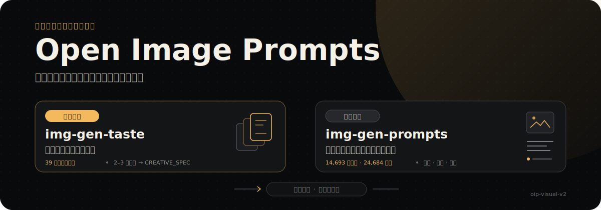

<p align="center">
  
</p>

<p align="center">
  <a href="./README.md">English</a> · <strong>简体中文</strong>
</p>

# Open Image Prompts

一个开源、本地优先的视觉提示词资料库，并提供两个可以安装到智能体中的 Skill：

- `img-gen-taste`：把模糊需求整理成明确的美术方向。
- `img-gen-prompts`：检索可追溯的提示词—图片参考，并打开本地对比画廊。

公开运行时快照包含 **14,693 条来源提示词**、**4,496 张已通过审核的本地图片**、**29,386 条翻译**、**170,226 条有效 v2 提示词标签**和 **185 个封闭视觉标签**。打标模型、回填工具、供应商配置、测试批次、错误日志以及其他打标过程记录均不在公开仓库中。

## 本地启动

环境要求：

- Git 和 [Git LFS](https://git-lfs.com/)
- Node.js `^20.19.0 || >=22.12.0`
- Python 3.10+

Windows、macOS 和 Linux 使用同一组命令：

```bash
git lfs install
git clone https://github.com/NanmiCoder/open-image-prompts.git
cd open-image-prompts
npm run setup
npm run dev
```

打开终端输出的本地地址。首次启动会把压缩 SQLite 解压到已忽略的 `.oip/runtime/`，启动仅监听本机回环地址的只读 API，然后启动 Vite 前端。

构建并预览生产前端：

```bash
npm run preview
```

跨平台启动器会在 Windows 自动寻找 `py -3` 或 `python`，在 macOS/Linux 自动寻找 `python3` 或 `python`。如 Python 使用自定义命令，可设置 `OIP_PYTHON`。

## 使用 Docker

Docker 会提供包含 Node.js 22 与 Python 3 的 Linux 隔离环境。镜像构建阶段会先执行公开数据校验、API/前端测试、lint 和生产构建，全部通过后才生成运行镜像：

```bash
git lfs pull
docker build -t open-image-prompts .
docker run --rm --name open-image-prompts -p 4173:4173 open-image-prompts
```

然后访问 <http://localhost:4173>。API 仍然只监听容器内部回环地址，仅通过前端代理对外提供；容器使用非特权 `node` 用户运行，并提供 `/health` 健康检查。

因为已审核图片和压缩 SQLite 都包含在项目内，Docker 构建上下文约为 900 MB。以上命令适用于 Windows/macOS 的 Docker Desktop 和 Linux Docker Engine。

## 安装 Skills

查看并安装两个 Skill：

```bash
npx skills add NanmiCoder/open-image-prompts --list
npx skills add NanmiCoder/open-image-prompts -g
```

`img-gen-taste` 使用内置风格卡，可以直接工作。`img-gen-prompts` 使用本仓库的公开 SQLite 和已审核图片：

```bash
export OIP_REPO_ROOT="$PWD"  # PowerShell: $env:OIP_REPO_ROOT = (Get-Location)
npm run status
```

准备完成后会返回 `"active_taxonomy_version": "oip-visual-v2"` 和 `"ready": true`。

## 公开数据边界

公开 DB 只保留产品运行所需数据：

- 来源提示词与来源链接；
- 已审核通过的本地图片记录；
- 中英文翻译；
- 有效 `oip-visual-v2` 提示词/图片标签；
- 公开 taxonomy 与 FTS 搜索索引。

公开 DB 不包含候选标签、模型或供应商配置、run ID、租约、模型理由、错误路径、评估表和 legacy 标签。图片只包含公开图片策略快照中状态为 `generated + allow` 的项目；未审核、`review`、`remove` 和扫描失败项目全部排除。

更多信息见 [DATASET.md](./DATASET.md)、[DATA_LICENSE.md](./DATA_LICENSE.md) 和机器可读的 [公开语料清单](./data/public-corpus.json)。

## 验证

```bash
npm test
npm run lint
npm run build
npm run status
```

API 与 Skill 均以只读 immutable 模式打开 SQLite。画廊默认只绑定 `127.0.0.1`，不会启动任何打标任务。

## 许可证

应用代码与 Skill 指令使用 [MIT License](./LICENSE)。数据许可和第三方内容边界单独记录在 [DATA_LICENSE.md](./DATA_LICENSE.md)。
